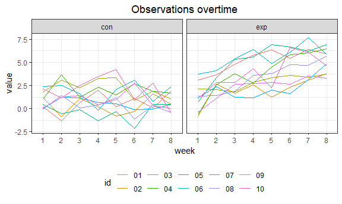
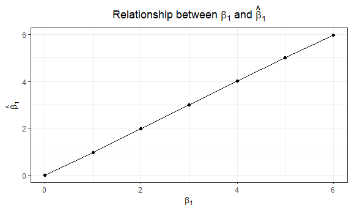
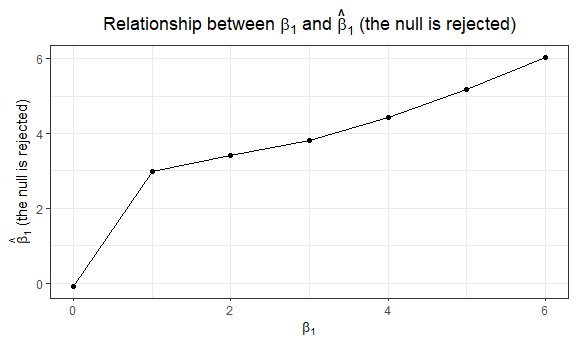

p8105\_hw5\_yl4359
================
Yue Lai

# Problem 1

``` r
iris_with_missing = iris %>% 
  map_df(~replace(.x, sample(1:150, 20), NA)) %>%
  mutate(Species = as.character(Species))
```

## Write a function

``` r
replace_na = function(vec){
  new_vec = c()
  if (is.numeric(vec)) {
    for (x in vec) {
      if (is.na(x)) {
        x = mean(vec, na.rm = TRUE)
      }
      new_vec = c(new_vec, x)
    }
  }
  if (is.character(vec)) {
    for (x in vec) {
      if (is.na(x)) {
        x = "virginica"
      }
      new_vec = c(new_vec, x)
    }
  }
  new_vec
}
```

## Apply the function

``` r
iris_without_missing = map_dfr(iris_with_missing, replace_na)
```

# Problem 2

## Construct a new dataframe

``` r
file_name = list.files(path = "./data")
data_path = str_c("./data/", file_name)
value = map2_df(.x = data_path, .y = "dddddddd", ~read_csv(file = .x, col_types = .y))
data = cbind(file_name, value)
```

## Tidy the dataset

``` r
new_data = data %>% 
  separate(file_name, into = c("group", "id"), sep = "_") %>% 
  mutate(id = str_replace(id, ".csv", "")) %>% 
  pivot_longer(week_1:week_8, names_to = "week", values_to = "value") %>% 
  mutate(week = str_replace(week, "week_", "")) 
```

## Make a plot

``` r
new_data %>% 
  ggplot(aes(x = week, y = value, group = id, color = id)) + 
  geom_line() +
  facet_grid(~group) +
  labs(title = "Observations over time") +
  scale_color_hue()
```



In the control group, the observation values did not have great change
over time, while in the experiment group, the observation values
increased over time.

# Problem 3

## Write a function

``` r
sim_regression = function(n = 30, beta0 = 2, beta1) {
  
  sim_data = tibble(
    x = rnorm(n, mean = 0, sd = 1),
    y = beta0 + beta1 * x + rnorm(n, mean = 0, sd = sqrt(50))
  )
  
  ls_fit = lm(y ~ x, data = sim_data) %>% 
    broom::tidy()
  
  tibble(
    beta1_hat = ls_fit[[2]][2],
    p_value = ls_fit[[5]][2]
  )
}
```

``` r
sim_results = 
  tibble(beta1_value = c(0, 1, 2, 3, 4, 5, 6)) %>% 
  mutate(
    output_lists = map(.x = beta1_value, ~rerun(10000, sim_regression(beta1 = .x))),
    estimate_dfs = map(output_lists, bind_rows)) %>% 
  select(-output_lists) %>% 
  unnest(estimate_dfs)
```

``` r
sim_results %>% 
  group_by(beta1_value) %>% 
  summarize(power = sum(p_value < 0.05)/10000) %>% 
  ggplot(aes(x = beta1_value, y = power)) + 
  geom_point() +
  geom_line() +
  labs(title = expression('Relationship between power and '*beta[1]),
       x = expression(beta[1]),
       y = "Power")
```


``` r
sim_results %>% 
  group_by(beta1_value) %>% 
  summarize(mean_beta1_hat1 = mean(beta1_hat)) %>% 
  ggplot(aes(x = beta1_value, y = mean_beta1_hat1)) + 
  geom_point() +
  geom_line() +
  labs(title = expression('Relationship between '*beta[1]*' and '*hat(beta)[1]),
       x = expression(beta[1]),
       y = expression(hat(beta)[1]))
```



``` r
sim_results %>% 
  group_by(beta1_value) %>% 
  filter(p_value < 0.05) %>% 
  summarize(mean_beta1_hat2 = mean(beta1_hat)) %>% 
  ggplot(aes(x = beta1_value, y = mean_beta1_hat2)) + 
  geom_point() +
  geom_line() +
  labs(title = expression('Relationship between '*beta[1]*' and '*hat(beta)[1]*' (the null is rejected)'),
       x = expression(beta[1]),
       y = expression(hat(beta)[1]*' (the null is rejected)'))
```



The sample average of \(\hat\beta_1\) across tests for which the null is
rejected don’t approximately equal to the true value of \(\beta_1\).
